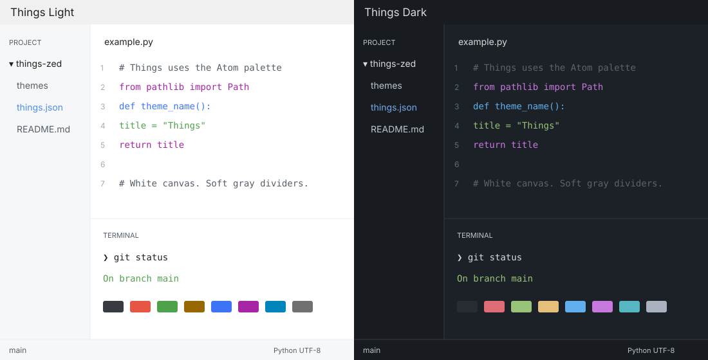

# Things for Zed

Things Light and Things Dark bring the colors of [Colin Eckert's Obsidian Things](https://github.com/colineckert/obsidian-things) to Zed. This port uses the locally installed Things 2.2.4 palette. Light mode has a white editor, pale gray sidebars, soft dividers, and blue accents. Dark mode uses Things' blue-gray editor and darker sidebars. The syntax and base terminal palettes come from Things' Atom code-block colors, with terminal bright slots matching the companion Ghostty port.



## Install

Follow Zed's [local theme installation](https://zed.dev/docs/themes#local-themes). Save your previous theme setting and any existing `~/.config/zed/themes/things.json` before replacing them. Clone the repository and copy the theme JSON into your Zed configuration directory:

```sh
git clone https://github.com/sergpryimachuk/things-zed.git
cd things-zed
mkdir -p ~/.config/zed/themes
cp themes/things.json ~/.config/zed/themes/things.json
```

Open Zed's user settings and set the top-level `theme` value to follow the system appearance:

```json
"theme": {
  "mode": "system",
  "light": "Things Light",
  "dark": "Things Dark"
}
```

You can also choose Things Light or Things Dark from Zed's theme selector. Restart Zed if the theme list or current window does not update. The manual method does not create backups.

### Optional convenience installer

This repository provides a Python convenience installer for automatic backups and settings updates. It is not provided by Zed. Run from the cloned repository:

```sh
python3 scripts/install.py
```

The installer copies `themes/things.json` into `~/.config/zed/themes` and changes only the top-level `theme` setting. It preserves comments, trailing commas, unrelated preferences, font sizes, and panel positions. Zed follows the system appearance with Things Light and Things Dark.

For a custom configuration directory:

```sh
python3 scripts/install.py --config-dir /path/to/zed
```

For theme development, Zed's Extensions panel can load this repository as a dev extension. This theme has not been published to Zed's extension store.

## Restore your previous appearance

Each run of the optional installer prints a backup directory under `~/.config/zed/things-backups/`. It contains the previous settings, any previous `things.json`, and a manifest recording which files existed.

Copy the saved `settings.json` back to `~/.config/zed/settings.json`. If `theme_existed` in the manifest is true, restore the saved `things.json` to `~/.config/zed/themes/things.json`. Otherwise, remove the installed `things.json`. A full settings restore also reverts later preference edits. To retain those edits, restore only the previous `theme` value from the saved settings.

## Palette and limits

The source is `Notes/.obsidian/themes/Things/theme.css`, version 2.2.4. The neutral UI colors and Atom syntax colors appear explicitly in `scripts/build.py`; the accents and muted grays use the source HSL formulas. The light accent is `#4c8ce6`; the dark accent is `#79a9ec`.

The terminal uses the editor canvas rather than Obsidian's inset code-block background, so it matches the other Things terminal ports. Light ANSI white uses `#707070` for readable white-slot text on a white canvas. Comments in light mode use Things' muted UI gray instead of its identical normal-code gray. Status colors use Things' mode-specific semantic palette. Syntax names are mapped to Zed's scopes, so highlighting varies by language grammar.

Zed theme files control colors and syntax emphasis. Obsidian CSS layout rules, round checkboxes, hover animations, heading sizes, and spacing cannot be reproduced by a Zed theme. Existing fonts and sizes stay intact. Use Zed's font settings separately if desired; Things uses the macOS system UI font and prefers JetBrains Mono, Fira Code, then Menlo for code.

The SVG is a palette and layout illustration, not a Zed screenshot.

## Rebuild and validate

```sh
python3 scripts/build.py
uv run --with jsonschema python scripts/validate.py
```

`validate.py` checks the committed theme against the official Zed v0.2.0 schema, rejects unknown style keys, and verifies valid hex colors. The bundled schema was downloaded from [Zed's official schema](https://zed.dev/schema/themes/v0.2.0.json). Theme structure and installation follow [Zed theme documentation](https://zed.dev/docs/extensions/themes) and [local theme installation](https://zed.dev/docs/themes#local-themes).

## Credits and license

Things for Obsidian was created by Colin Eckert. Its upstream MIT license credits Stephan Ango, `@kepano`, copyright 2020-2021. `LICENSE` preserves that notice verbatim. This adaptation is distributed under the same MIT terms. This is an independent local port, unaffiliated with the Things app, Obsidian, or Zed.
